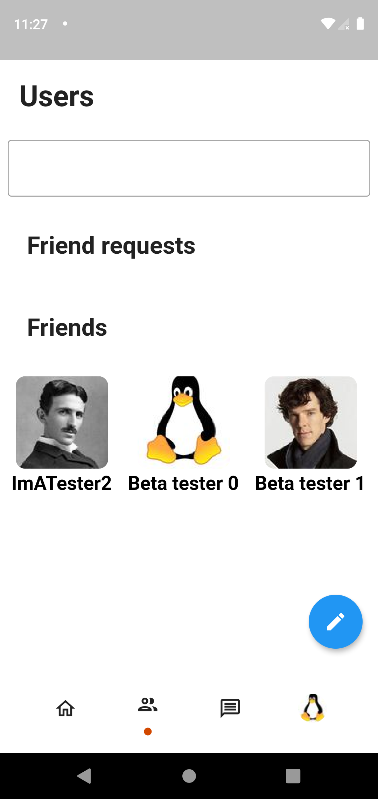

# Mines'Trix : A Matrix social media

FLUTTER version

Connect people without sacrifying privacy.


  |  |  |  
:-------------------------:|:-------------------------:|:-------------------------:|:-------------------------:
Feed vue        |  Friends vue | Chats vue | User vue
## Goal of the platform

* Enable people share information freely between friends
* Create event, celebrate birthday or party
* Networking : enable people to ~~build~~ revive networks
* Simple : privacy online shouldn't be a geek only thing
* Be able to choose the algorithms to sort your posts.
* :rocket: We rock

## Keywords

**privacy**, **simple**

## Why should I use it ?

* For Privacy : you own all your post which are E2E encrypted
* For freedom : you choose how your post are sorted by an open, transparent algorithm you can choose

## Why matrix ?

* because we don't wan't to reinvant the wheel and a social media need a messaging platform
* Matrix : Secure, decentralised give back control to people. And... because it's Open Source !!
* we could use matrix rooms to store personal data

### Why it will benefit the matrix ecosystem

* Help other discover other users (enable an easier user discoveration (woooo... TODO : find a better name))
* Could convince people to know and adopt matrix

## Be a game changer, help us spread the world

* Try, and love, tell us what you think
* Tell your friends about it, the more you spread, the less you relie on other social media

## Want to go further, help us build the future

* Code
* Translate

## Features

* Profile : post and see what your friends have posted
* Events :
	* birthday (remind people of their friend birthday)
	* Events : federate people
* Groups : A formal way of sharing information between people
* Share pictures

## Roadmap

### V1.0 : (Work in progress)

- [x] Account creation
- [x] Display account feed
- [x] Send posts
- [x] Send/Display images
- [ ] Adding and removing friends (partial)
- [x] Implement sorting algorithm by date
	- [x] By date
- [x] E2EE: Device verification

### V2.0 : Planned

- [ ] Implement E2E (device verification working)
- [ ] Events and groups (pages) (in progress)
- [ ] Sorting : Custom one (we could use some federate learning tech here)

## How it works ?

## [Specifications](https://gitlab.com/minestrix/minestrix-doc)

Find our documentation in our [separate repo](https://gitlab.com/minestrix/minestrix-doc)

### Using matrix rooms

When we create an account : we create a room and we invite in it all our friends

* Adding a friend involve adding a user to our created room

Using this we could benefit using E2E encryption and be sure only our friends could see our posts

## Displaying feed

Our client retrive all the rooms and then using the algorithm we choose to display posts.

## Posting

we just send a post to our custom room

## Adding, sending friend request and removing friends

* Add to your conversations

We should decide if we accept that "friendship" could be one way (I add you to my friend list but you don't)
I think we should only accept two way
TODO : think to how we could implement this (TLS handshake :D )

## Contributing

### Before publish a commit

Make sure to run ./scripts/before_commit.sh

## Building

### Installing OLM

We use the fameldy library for that [https://gitlab.com/famedly/libraries/dart-olm](https://gitlab.com/famedly/libraries/dart-olm)

## For linux platforms

### Requirements

* libsqlite3

```bash
sudo apt install libolm3 libsqlite3-dev
```

## Special thanks to

[famedlysdk](https://gitlab.com/famedly/famedlysdk/)

[fluffy chat](https://gitlab.com/famedly/fluffychat)
