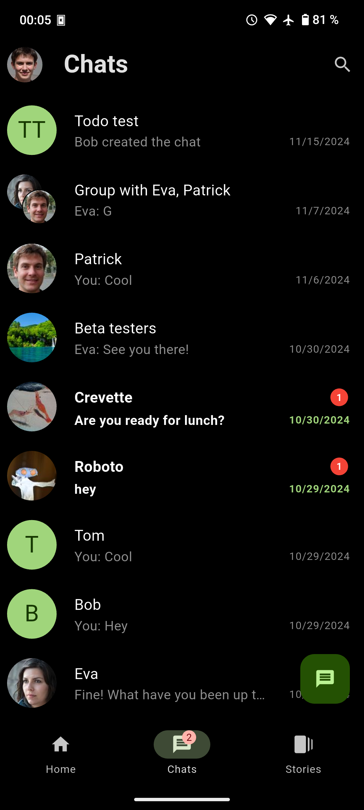

# MinesTRIX

**A privacy focused social media based on MATRIX**

<div>



</div>

<div>

</div>


[Chat with us !](https://matrix.to/#/#minestrix:carnot.cc)


## 🤔 Why

The goal of MinesTrix is to create an alternative social media focused on privacy. We believe that privacy is a fundamental right and that when you share something, no third party should be able to see your posts or edit them.
That's why MinesTrix supports E2EE (not by default yet) to protect your posts and is decentralized to be able to choose where your data is stored.


We chose MATRIX because it's the best protocol for supporting decentralized, E2EE communication and because it's Open Source !!

## ✨ Features

* Simplicity
* Privacy : E2EE using [Olm](https://gitlab.matrix.org/matrix-org/olm)
* No analytics
* Post and see what your friends are saying
* Create groups
* Find your friends
* Chat : supports chats
* Not for profit

## 🚀 Goals

* [ ] E2EE
* [ ] Filter and sort your feed as you want
* [ ] P2P

## 😀🏆 Contributing

### Be a game changer, help us spread the world

* Try and tell us what you think
* Spread the world 🎉

### Want to go further, help us build the future

* Code
* Translate (will come later)

### Before publish a commit

Make sure to run

```bash
./scripts/before_commit.sh
```

## 🛣 Roadmap

### V1.0 : (Work in progress)

- [x] Account creation
- [x] Display account feed
- [x] Send posts
- [x] Send/Display images
- [ ] Adding and removing friends (partial)
- [x] Implement sorting algorithm by date
	- [x] By date
- [x] E2EE: Device verification

### V2.0 : Planned

- [ ] Implement E2E (device verification working)
- [ ] Events and groups (pages) (in progress)
- [ ] Sorting : Custom one (we could use some federate learning tech here)

## 🧐 How it works ?

## [Specifications](https://gitlab.com/minestrix/minestrix-doc)

Find our documentation in our [separate repo](https://gitlab.com/minestrix/minestrix-doc)

## 🏗 Building

WIP 🙃

```bash
flutter packages pub run build_runner watch
```

### Linux

```bash
flutter build linux
```

### Installing OLM

We use the fameldy library for that [https://gitlab.com/famedly/libraries/dart-olm](https://gitlab.com/famedly/libraries/dart-olm)

## For linux platforms

### Requirements

* libsqlite3

From https://pub.dev/packages/flutter_secure_storage :

* libsecret
* libjsoncpp

```bash
sudo apt install libolm3 libsqlite3-dev libsecret-1-dev libjsoncpp-dev
```

## Special thanks to

[famedlysdk](https://gitlab.com/famedly/famedlysdk/)

[fluffy chat](https://gitlab.com/famedly/fluffychat)
